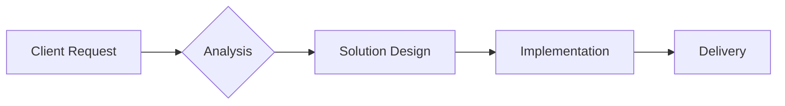
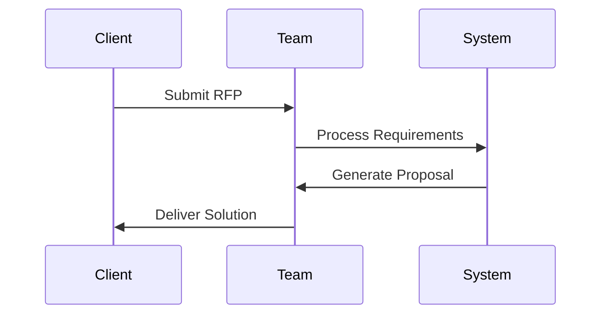
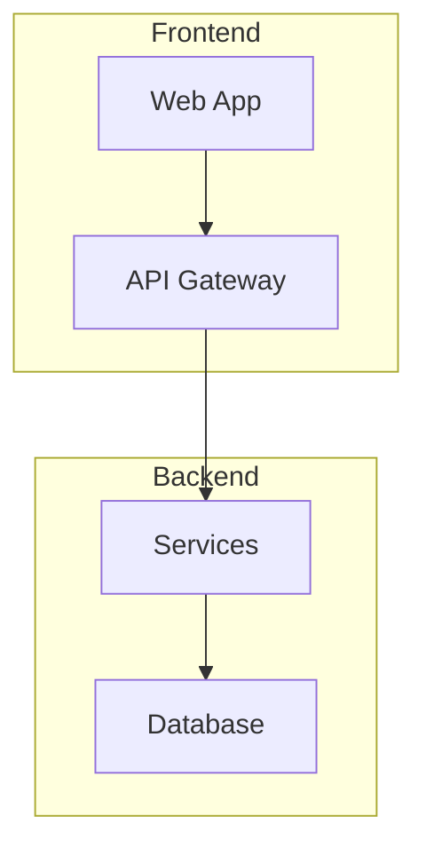
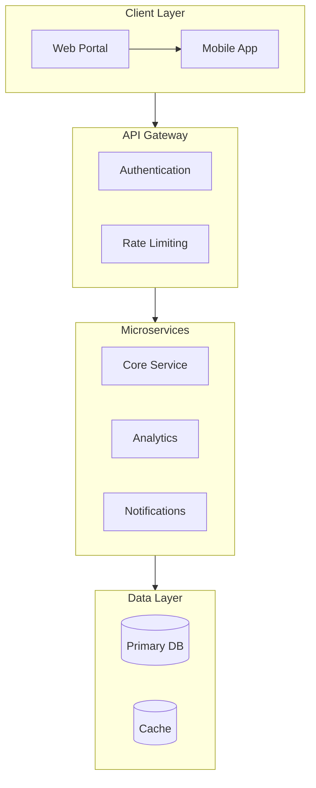

# MARP Presentation Style Guide

This guide provides styling instructions for generating professional PowerPoint presentations using MARP Markdown format.

---

## 1. Themes

### Built-in Themes
Marp comes with default themes that can be specified in the front matter:

```yaml
---
marp: true
theme: gaia  # Options: default, gaia, uncover
---
```

### Custom Theme Reference
For advanced styling, reference a custom CSS theme:

```yaml
---
marp: true
theme: custom-default
---
```

---

## 2. Custom CSS Styling

Include a `<style>` block at the top of your presentation for consistent branding:

```css
<style>
/* Global slide styling */
section {
  font-family: 'Helvetica Neue', Helvetica, Arial, sans-serif;
  font-size: 24px;
  padding: 40px;
  background: linear-gradient(135deg, #667eea 0%, #764ba2 100%);
}

/* Header styling */
h1 {
  color: #2c3e50;
  font-size: 48px;
  font-weight: 700;
  border-bottom: 3px solid #7c3aed;
  padding-bottom: 10px;
}

h2 {
  color: #374151;
  font-size: 36px;
}

/* Primary accent color - matches app theme */
.accent {
  color: #7c3aed;
}

/* Dark/inverted slides */
section.invert {
  background: linear-gradient(135deg, #1e1e2e 0%, #2d1b4e 100%);
  color: #ffffff;
}

section.invert h1 {
  color: #a78bfa;
}

/* Lead slide styling */
section.lead {
  display: flex;
  flex-direction: column;
  justify-content: center;
  text-align: center;
}

/* Two-column layout */
.columns {
  display: grid;
  grid-template-columns: 1fr 1fr;
  gap: 20px;
}

/* Card-style boxes */
.card {
  background: rgba(255, 255, 255, 0.1);
  border-radius: 12px;
  padding: 20px;
  border: 1px solid rgba(255, 255, 255, 0.2);
}

/* Bullet points */
ul {
  list-style: none;
  padding-left: 0;
}

ul li::before {
  content: "▸ ";
  color: #7c3aed;
  font-weight: bold;
}

/* Tables */
table {
  width: 100%;
  border-collapse: collapse;
  margin: 20px 0;
}

th {
  background: #7c3aed;
  color: white;
  padding: 12px;
}

td {
  padding: 10px;
  border-bottom: 1px solid #e5e7eb;
}

/* Footer styling */
footer {
  font-size: 14px;
  color: #6b7280;
}
</style>
```

---

## 3. Background Images and Layouts

### Full Background Image
```markdown

```

### Split Background (Right)
```markdown


# Slide Title
Content on the left side
```

### Split Background (Left)
```markdown


# Slide Title
Content on the right side
```

### Multiple Backgrounds
```markdown


```

### Background Filters
```markdown


```

### Placeholder Images (Unsplash)
Use dynamic placeholder images from Unsplash:
```markdown


```

---

## 4. Slide Directives

### Class Directives
```markdown
<!-- _class: invert -->  # Dark background
<!-- _class: lead -->    # Centered content
```

### Background Color
```markdown
<!-- _backgroundColor: #1e1e2e -->
<!-- _backgroundColor: linear-gradient(135deg, #667eea 0%, #764ba2 100%) -->
```

### Color Override
```markdown
<!-- _color: white -->
```

### Pagination
```yaml
---
marp: true
paginate: true
---
```

---

## 5. Mermaid Diagrams

### Flowchart
```markdown

```

### Sequence Diagram
```markdown

```

### Architecture Diagram
```markdown

```

---

## 6. Design Principles

### The 5/5/5 Rule
- Maximum 5 bullet points per slide
- Maximum 5 words per bullet point
- Maximum 5 text-heavy slides in a row

### Visual Hierarchy
1. One main idea per slide
2. Use large, bold headings
3. Support with minimal text
4. Include visuals when possible

### Color Palette (App Theme)
- Primary: `#7c3aed` (Purple)
- Primary Light: `#a78bfa`
- Background Dark: `#1e1e2e`
- Text Light: `#ffffff`
- Text Dark: `#2c3e50`
- Accent: `#06b6d4` (Cyan)

---

## 7. Recommended Slide Structure (10-15 Slides)

1. **Title Slide** - Company name, proposal title, date
   - Use `<!-- _class: invert -->` with split background

2. **Executive Summary** - Key value proposition (3-5 bullets)
   - Clean white background with accent colors

3. **Client Understanding** - Show you understand their needs
   - Use icons or visual representations

4. **Requirements Overview** - Summarize key requirements
   - Table format or numbered list

5. **Proposed Solution** - Your approach
   - **MUST include Mermaid diagram** for architecture/process

6. **Methodology** - How you'll deliver
   - Timeline or process flow diagram

7. **Technology Stack** - Tools and platforms
   - Icons with brief descriptions

8. **Team Introduction** - Key team members
   - Circular avatar placeholders

9. **Case Studies** - Relevant experience
   - Split background with results/metrics

10. **Timeline & Milestones** - Project schedule
    - Visual timeline or Gantt-style

11. **Pricing Overview** - Investment summary
    - Clean table format

12. **Risk Management** - How you mitigate risks
    - Card-style layout

13. **Why Choose Us** - Differentiators
    - Bold statements with icons

14. **Next Steps** - Call to action
    - Clear, actionable items

15. **Contact & Q&A** - Contact information
    - Use `<!-- _class: lead invert -->`

---

## 8. Example Title Slide

```markdown
---
marp: true
theme: gaia
class: lead
paginate: true
backgroundColor: #1e1e2e
color: #ffffff
---

<style>
section {
  font-family: 'Helvetica Neue', sans-serif;
}
h1 {
  color: #a78bfa;
  font-size: 56px;
}
</style>

<!-- _class: invert -->


# Proposal for **{Client Name}**

## {Service Type} Solution

**Prepared by:** {Company Name}
**Date:** {Date}

---
```

---

## 9. Example Solution Slide with Mermaid

```markdown
---

# Proposed Architecture



**Key Benefits:**
- Scalable microservices architecture
- Real-time analytics and monitoring
- Secure authentication layer

---
```

---

## 10. HTML Enhancements (if enableHtml is true)

### Icons (Font Awesome style)
```html
<i class="fa fa-check-circle" style="color: #7c3aed;"></i> Feature enabled
```

### Custom Divs
```html
<div class="card">
  <h3>Key Metric</h3>
  <p style="font-size: 48px; color: #7c3aed;">95%</p>
  <p>Client Satisfaction</p>
</div>
```

### Two-Column Layout
```html
<div class="columns">
  <div>
    <h3>Before</h3>
    <p>Manual processes</p>
  </div>
  <div>
    <h3>After</h3>
    <p>Automated workflows</p>
  </div>
</div>
```

---

*Last Updated: 2024*
*For use with Pursuit AI PPT Generation Agent*
