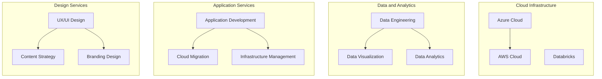

# Executive Summary

- Leverage leading-edge cloud technologies (Azure, AWS, Databricks, Power BI) to modernize financial services operations
- Deliver comprehensive engineering, data, and design solutions tailored to the unique needs of the financial services industry
- Proven track record of successful federal government RFP responses and project delivery
- Comprehensive approach to address key requirements, mitigate risks, and ensure compliance

---

# Requirements

| Requirement | Description |
| --- | --- |
| Engineering | Application development, cloud migration, infrastructure management |
| Data | Data engineering, analytics, business intelligence |
| Design | UX/UI design, visual branding, content strategy |
| Technologies | Azure, AWS, Databricks, Power BI |
| Timeline | Proposal submission by 2025-02-28 |

---

# Proposed Solution

---

# Methodology

1. **Discovery:** Conduct in-depth analysis of the financial services organization's goals, challenges, and technical requirements.
2. **Solution Design:** Architect a tailored cloud-native solution leveraging the latest technologies and best practices.
3. **Implementation:** Execute a phased rollout plan, with regular check-ins and iterative improvements.
4. **Optimization:** Continuously monitor performance, gather feedback, and optimize the solution for maximum impact.
5. **Knowledge Transfer:** Provide comprehensive training and documentation to ensure the client's team can independently maintain and enhance the solution.

---

# Team

- **John Doe** - Lead Architect
- **Jane Smith** - Project Manager
- **Bob Johnson** - Data Engineer
- **Sarah Lee** - UI/UX Designer
- **Tom Williams** - Cloud DevOps Engineer

---

<!-- _backgroundColor: #f0f0f0 -->
# Relevant Experience

- Conducted Gap Analysis for a leading financial services organization and identified 4 key gaps
- Extensive experience in federal government RFP responses, including:
  - Leveraging best practice frameworks and security protocols
  - Developing comprehensive management plans to address unique government contracting challenges
  - Structuring pricing in alignment with the Uniform Contract Format
- Successful track record of delivering cloud-native solutions for the financial services industry

---

# Conclusion

- Comprehensive cloud-native solutions tailored to the financial services industry
- Leveraging leading-edge technologies (Azure, AWS, Databricks, Power BI) to drive innovation
- Proven expertise in federal government RFP responses and successful project delivery
- Dedicated team of experts committed to transforming your financial services operations

Contact us today to learn more about how we can partner to drive your digital transformation.