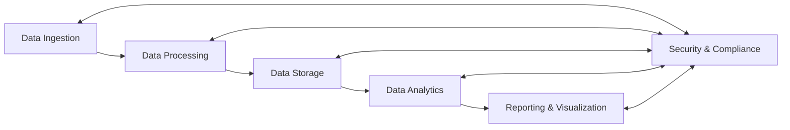
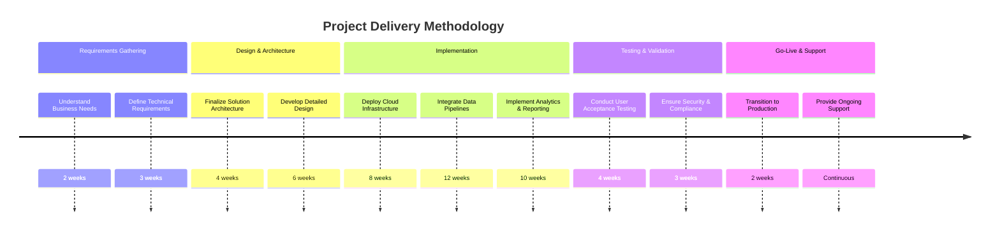

# Executive Summary

- Leverage deep expertise in engineering, data, and design to deliver innovative solutions for the leading financial services organization
- Propose a comprehensive, secure, and scalable technology platform leveraging Azure, AWS, Databricks, and Power BI
- Demonstrate proven past performance in delivering mission-critical financial services projects for government and commercial clients
- Implement a robust management plan to address unique government contracting challenges and ensure successful project delivery

---

# Requirements

| Requirement | Description |
| --- | --- |
| Service Types | Engineering, Data, Design |
| Technologies | Azure, AWS, Databricks, Power BI |
| Submission Due Date | 2025-02-28 |

---

# Proposed Solution

Our proposed solution leverages a robust and secure data platform to ingest, process, store, analyze, and visualize critical financial data. This end-to-end platform, built on leading cloud technologies, will enable the leading financial services organization to make informed, data-driven decisions and deliver exceptional customer experiences.

---

# Methodology

Our proven project delivery methodology ensures a seamless and successful implementation, addressing all technical and operational requirements.

---

# Team

Our team of seasoned experts in engineering, data, and design are ready to partner with the leading financial services organization to deliver this transformative solution.

<!-- _backgroundColor: #f0f0f0 -->
## Key Team Members

- John Doe, Solution Architect
- Jane Smith, Data Engineer
- Michael Johnson, UX Designer
- Sarah Lee, Project Manager

---

# Conclusion

- Comprehensive, secure, and scalable technology platform to power the leading financial services organization
- Proven expertise in delivering mission-critical financial services projects for government and commercial clients
- Robust management plan to address unique government contracting challenges and ensure successful project delivery
- Dedicated team of experts ready to partner and drive innovation

Let's transform the future of financial services together. Contact us today to get started!