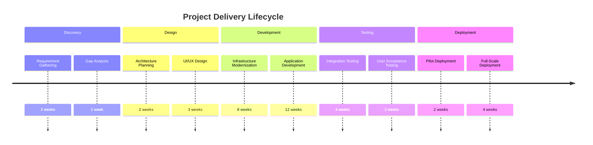

# Executive Summary

- Leverage deep expertise in engineering, data, and design to deliver innovative solutions for the leading financial services organization
- Propose a comprehensive technology roadmap utilizing Azure, AWS, Databricks, and Power BI to modernize the client's infrastructure and drive data-driven decision-making
- Demonstrate proven track record of successfully executing complex projects in the financial services industry, ensuring compliance and minimizing risk
- Develop a robust management plan to address unique government contracting challenges and ensure seamless project delivery

---

# Requirements

| Requirement | Description |
| --- | --- |
| Engineering | Modernize infrastructure, develop custom applications, and implement DevSecOps practices |
| Data | Implement advanced analytics and business intelligence capabilities using Databricks and Power BI |
| Design | Enhance user experience and visual design of client-facing applications |
| Technologies | Azure, AWS, Databricks, Power BI |
| Submission Due Date | 2025-02-28 |

---

# Proposed Solution


```mermaid
flowchart TB
  subgraph Azure
    AzureServices["Azure Services"]
    AzureSQL["Azure SQL Database"]
    AzureStorageBlob["Azure Blob Storage"]
  end
  subgraph AWS
    AWSServices["AWS Services"]
    AWSRedshift["AWS Redshift"]
    AWSLambda["AWS Lambda"]
  end
  subgraph Databricks
    Databricks["Databricks Unified Analytics Platform"]
  end
  subgraph PowerBI
    PowerBI["Power BI"]
  end

  AzureServices <--> AzureSQL
  AzureServices <--> AzureStorageBlob
  AWSServices <--> AWSRedshift
  AWSServices <--> AWSLambda
  Databricks <--> AzureSQL
  Databricks <--> AWSRedshift
  PowerBI <--> AzureSQL
  PowerBI <--> AWSRedshift
```

---

# Methodology




---

# Team


- **Project Manager:** Jane Doe
- **Lead Architect:** John Smith
- **Data Scientist:** Emily Johnson
- **UX Designer:** Michael Williams
- **DevOps Engineer:** Sarah Lee

---

<!-- _backgroundColor: #f0f0f0 -->
# Why Choose Us?

- Deep expertise in engineering, data, and design for the financial services industry
- Proven track record of successful project delivery, ensuring compliance and minimizing risk
- Comprehensive technology roadmap leveraging Azure, AWS, Databricks, and Power BI
- Robust management plan to address unique government contracting challenges
- Dedicated team of experienced professionals committed to your success

---

<!-- _class: invert -->
# Conclusion

We are excited to partner with the leading financial services organization to transform their technology capabilities and drive data-driven decision-making. Our comprehensive solution, experienced team, and proven methodology will ensure a successful and compliant project delivery.

Let's connect to discuss how we can bring your vision to life.

[Jane Doe, Project Manager]
[jane.doe@company.com]
[555-555-5555]