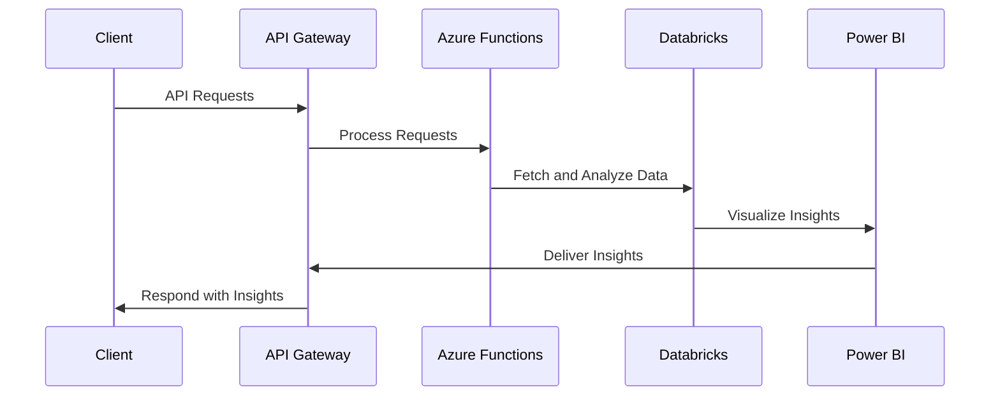

## Executive Summary

As a leading financial services organization, we are uniquely positioned to deliver innovative cloud-native solutions that address your evolving technology needs. Our comprehensive expertise in engineering, data, and design, coupled with our deep understanding of the financial services industry, will enable us to develop tailored solutions that drive efficiency, enhance customer experiences, and unlock new growth opportunities.

---

## Requirements

| Requirement | Description |
| --- | --- |
| Engineering | Develop scalable, secure, and cloud-native applications leveraging Azure and AWS |
| Data | Implement advanced data analytics and visualization capabilities using Databricks and Power BI |
| Design | Create intuitive and user-centric digital experiences for both internal and external stakeholders |

---

## Proposed Solution

---

## Methodology

Our proven methodology ensures a seamless and collaborative engagement, delivering tangible results at each stage:

1. **Discovery**: Understand your unique requirements, pain points, and business objectives.
2. **Design**: Craft a tailored, cloud-native architecture that aligns with your technology landscape.
3. **Development**: Iteratively build and deploy scalable, secure, and user-centric solutions.
4. **Deployment**: Ensure a smooth transition and provide ongoing support and maintenance.

---

## Team

   

Our multidisciplinary team of experts brings a wealth of experience in delivering transformative cloud-native solutions for the financial services industry. With a deep understanding of your unique challenges and a proven track record of success, we are committed to empowering your organization to thrive in the digital age.

---

<!-- _backgroundColor: #f0f0f0 -->
## Conclusion

By partnering with us, you will gain access to a comprehensive suite of cloud-native solutions that will drive your financial services organization forward. Our expertise, innovative approach, and unwavering commitment to your success will ensure that you stay ahead of the curve and deliver exceptional experiences to your customers.

We look forward to the opportunity to discuss our proposal in greater detail. Please don't hesitate to reach out to us with any questions or concerns.

---

<!-- _class: invert -->

# Thank you!

Contact us:
- Email: info@financialservices.com
- Phone: 555-555-5555
- Website: www.financialservices.com