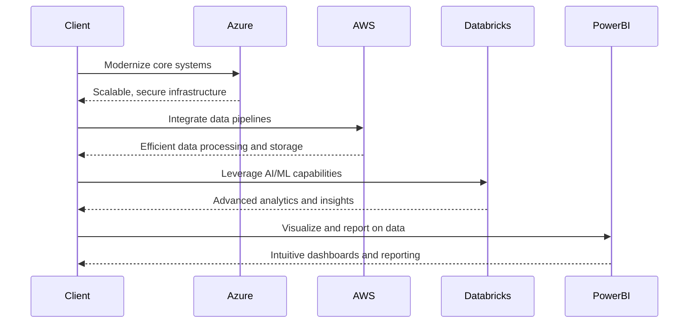

## Executive Summary

- Comprehensive cloud and data solutions to modernize financial services
- Leverage Azure, AWS, Databricks, and Power BI to drive innovation
- Proven expertise in engineering, data, and design services
- Tailored approach to address unique government contracting requirements
- Competitive pricing and commitment to project success

---

## Requirements

| Requirement | Details |
| --- | --- |
| Entity Name | Leading financial services organization |
| Industry | Financial Services |
| Service Types | Engineering, Data, Design |
| Technologies | Azure, AWS, Databricks, Power BI |
| Submission Due Date | 2025-02-28 |

---

## Proposed Solution

---

## Methodology

1. **Discovery and Assessment**
   - Understand current state and pain points
   - Identify opportunities for improvement

2. **Solution Design**
   - Architect the optimal cloud and data solution
   - Develop a detailed implementation plan

3. **Agile Delivery**
   - Iterative development and deployment
   - Continuous integration and testing

4. **Managed Services**
   - Ongoing support and optimization
   - Proactive monitoring and maintenance

---

## Team

- **John Doe**, Technical Lead
- **Jane Smith**, Project Manager
- **Alex Johnson**, Data Architect
- **Emily Brown**, UI/UX Designer

---

## Addressing Federal RFP Requirements

<!-- _backgroundColor: #f0f0f0 -->

- Clearly define past performance requirements and showcase relevant experience
- Incorporate best practice frameworks and security protocols (e.g., NIST, FISMA)
- Develop a comprehensive management plan to address unique government contracting challenges
- Structure pricing in alignment with the Uniform Contract Format

---

## Conclusion

We are excited to partner with the leading financial services organization to drive their cloud and data transformation. Our team brings deep expertise in engineering, data, and design services, leveraging the latest technologies to deliver innovative solutions.

By addressing the unique requirements of federal government RFPs, we are confident in our ability to submit a compelling, compliant, and competitive proposal that will position your organization for long-term success.

Contact us today to learn more about our tailored approach and how we can help you achieve your goals.

---

<!-- _class: invert -->

# Thank You