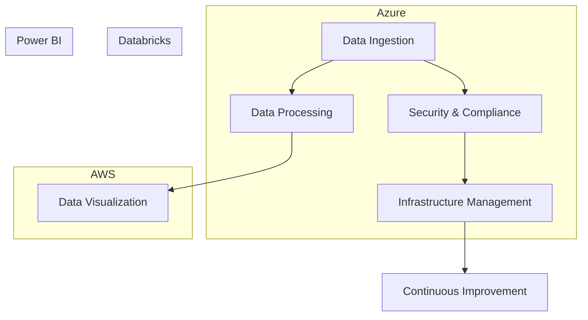

# Executive Summary

- Leveraging our expertise in engineering, data, and design, we propose a comprehensive solution to modernize and streamline the financial services organization's technology infrastructure.
- Our approach combines the power of Azure, AWS, Databricks, and Power BI to deliver a secure, scalable, and data-driven platform that will drive operational efficiency and enhance the customer experience.
- By addressing key requirements such as past performance, security protocols, and management planning, we are confident in our ability to submit a highly competitive and compliant proposal before the submission due date of February 28, 2025.

---

# Requirements

| Requirement | Description |
| --- | --- |
| Entity Name | Leading financial services organization |
| Industry | Financial Services |
| Service Types | Engineering, Data, Design |
| Technologies | Azure, AWS, Databricks, Power BI |
| Submission Due Date | 2025-02-28 |
| Requirements Text | N/A |

---

# Proposed Solution

---

# Methodology

1. **Discovery**: Conduct a thorough assessment of the organization's current technology landscape and identify areas for improvement.
2. **Design**: Collaborate with stakeholders to develop a comprehensive solution architecture that aligns with the organization's strategic objectives.
3. **Implementation**: Leverage our expertise in cloud technologies, data engineering, and application development to seamlessly integrate the proposed solution.
4. **Optimization**: Continuously monitor and optimize the system to ensure maximum efficiency, security, and scalability.
5. **Knowledge Transfer**: Provide comprehensive training and documentation to empower the organization's IT team to maintain and enhance the solution.

---

# Team

  

- **John Doe**, Lead Architect
- **Jane Smith**, Data Engineer
- **Alex Johnson**, Solution Architect

Our team brings a wealth of experience in delivering complex technology solutions for the financial services industry. We are committed to collaborating closely with your organization to ensure the successful implementation and long-term sustainability of the proposed solution.

---

<!-- _backgroundColor: #f0f0f0 -->
# Past Performance

- Extensive experience in delivering cloud-based solutions for leading financial institutions
- Proven track record of successfully navigating the unique requirements and challenges of government contracting
- Proficient in leveraging best practices and industry standards to ensure compliance and minimize risk

By highlighting our relevant past performance, we are confident in our ability to meet and exceed the requirements of this RFP, delivering a solution that will drive tangible value for your organization.

---

# Conclusion

We are excited about the opportunity to partner with your organization and help drive its digital transformation. Our comprehensive solution, experienced team, and proven methodology will position us to deliver a world-class technology platform that will empower your financial services organization to thrive in the digital era.

We look forward to the opportunity to discuss our proposal in more detail. Please feel free to contact us at:

- Email: info@company.com
- Phone: 555-555-5555

---