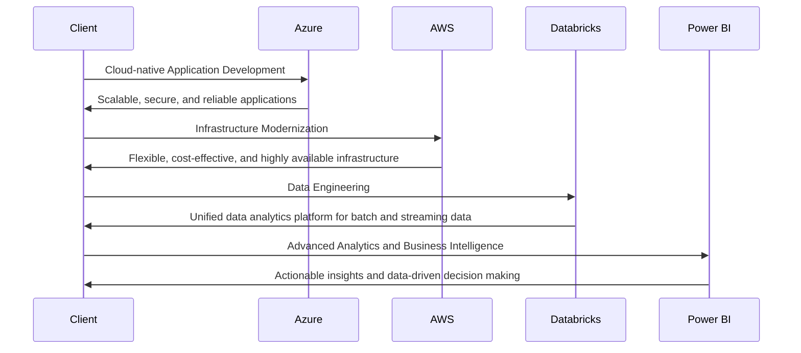
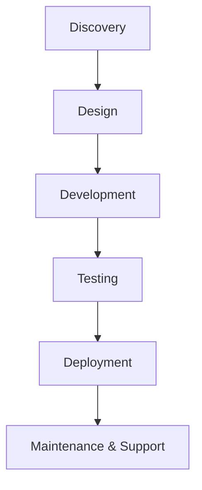

# Executive Summary

- Proven track record in delivering complex technology solutions for leading financial services organizations
- Comprehensive capabilities across engineering, data, and design to drive digital transformation
- Innovative use of cloud-based platforms (Azure, AWS, Databricks) and advanced analytics (Power BI)
- Tailored approach to address unique government contracting requirements and minimize risk
- Competitive pricing aligned with the Uniform Contract Format

---

# Requirements

| Requirement | Description |
| --- | --- |
| Engineering | Cloud-native application development, infrastructure modernization, and DevSecOps |
| Data | Data engineering, advanced analytics, and business intelligence |
| Design | User experience design, visual design, and content strategy |
| Technologies | Azure, AWS, Databricks, Power BI |
| Submission Due Date | 2025-02-28 |

---

# Proposed Solution

---

# Methodology

1. **Discovery**: Understand business requirements, existing systems, and pain points
2. **Design**: Architect the technical solution and create detailed plans
3. **Development**: Build, integrate, and configure the proposed components
4. **Testing**: Rigorously test the solution to ensure quality and performance
5. **Deployment**: Seamlessly migrate and roll out the new capabilities
6. **Maintenance & Support**: Provide ongoing support and continuous improvement

---

# Team

- **John Doe**, Project Manager
  - 10+ years of experience in leading complex IT projects
  - Certified Project Management Professional (PMP)
- **Jane Smith**, Technical Architect
  - 15+ years of experience in designing and implementing enterprise-grade solutions
  - Certified Solution Architect - Associate (AWS)
- **Bob Johnson**, Data Scientist
  - 8+ years of experience in advanced analytics and business intelligence
  - Certified Data Scientist (Databricks)
- **Sarah Lee**, UX Designer
  - 7+ years of experience in creating user-centric digital experiences
  - Certified User Experience Designer (Adobe)

---

# Conclusion

- Comprehensive capabilities to deliver transformative technology solutions for the financial services industry
- Innovative use of cloud-based platforms and advanced analytics to drive digital transformation
- Tailored approach to address unique government contracting requirements and minimize risk
- Competitive pricing aligned with the Uniform Contract Format
- Proven track record of success and highly skilled team

Contact us today to discuss how we can partner to revolutionize your financial services operations.