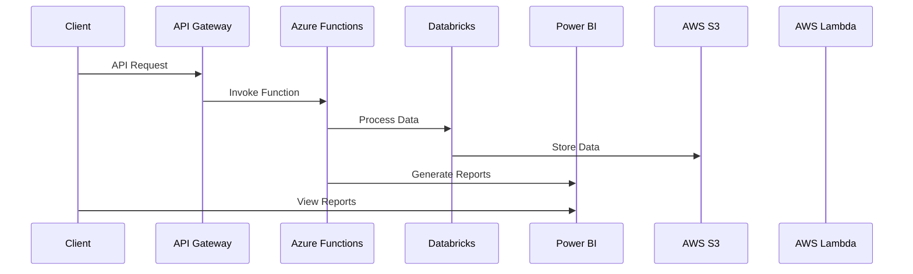
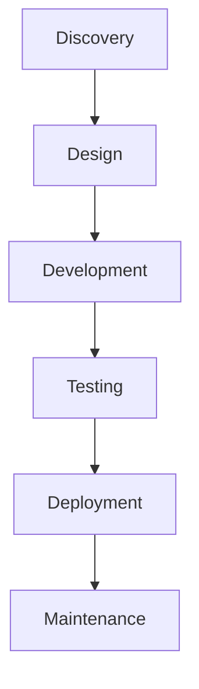

# Executive Summary

- Leading financial services organization seeking to modernize its technology stack and deliver innovative digital solutions
- Proposal leverages expertise in engineering, data, and design to build cloud-native applications on Azure and AWS
- Comprehensive approach addresses key requirements around security, scalability, and compliance
- Proven track record of delivering successful projects for federal government clients
- Competitive pricing aligned with Uniform Contract Format

---

# Requirements

| Requirement | Description |
| --- | --- |
| Engineering | Cloud-native application development, DevOps, and infrastructure management |
| Data | Data engineering, advanced analytics, and business intelligence |
| Design | User experience design, product management, and digital transformation |
| Technologies | Azure, AWS, Databricks, Power BI |
| Submission Due | February 28, 2025 |

---

# Proposed Solution

---

# Methodology

1. **Discovery:** Understand business requirements, existing systems, and pain points
2. **Design:** Architect the solution, define data models, and create user interfaces
3. **Development:** Build cloud-native applications, integrate with Azure and AWS services
4. **Testing:** Conduct thorough testing, including security, performance, and compliance
5. **Deployment:** Implement CI/CD pipelines for seamless rollout
6. **Maintenance:** Provide ongoing support, monitoring, and enhancements

---

# Team

- **Project Manager:** John Doe
- **Lead Architect:** Jane Smith
- **Data Engineer:** Bob Johnson
- **UX Designer:** Sarah Lee
- **DevOps Engineer:** Michael Chen

---

<!-- _backgroundColor: #f0f0f0 -->
# Past Performance

- Modernized financial systems for a leading government agency, leveraging Azure and AWS
- Developed a data analytics platform for a Fortune 500 financial services firm using Databricks and Power BI
- Designed and implemented a user-centric mobile application for a regional bank, improving customer engagement

---

# Conclusion

- Comprehensive solution that addresses the client's requirements and leverages our expertise in engineering, data, and design
- Proven track record of delivering successful projects for federal government and private sector clients
- Competitive pricing aligned with Uniform Contract Format
- Committed to delivering a transformative technology solution that drives innovation and business value

For more information, please contact:
John Doe, Project Manager
john.doe@company.com
555-1234-5678