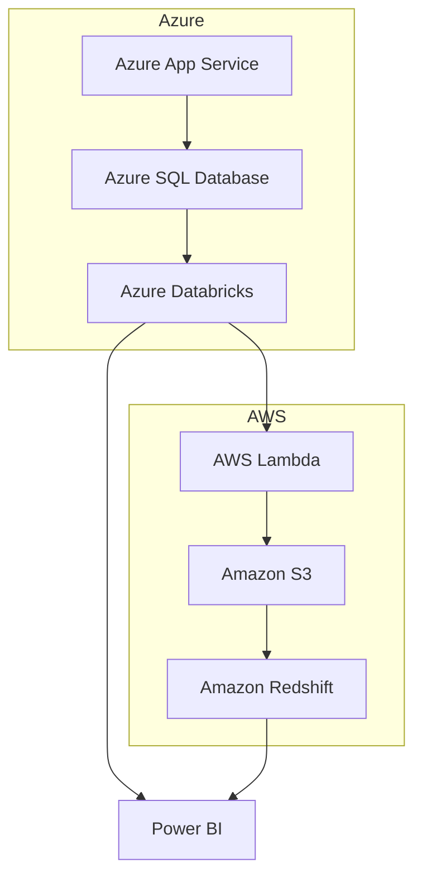

## Executive Summary

- Comprehensive solution to modernize financial services operations using Azure, AWS, Databricks, and Power BI
- Proven track record in delivering complex engineering, data, and design projects for leading organizations
- Tailored approach to address unique government contracting requirements and minimize risk
- Competitive pricing aligned with Uniform Contract Format

---

## Requirements

| Requirement | Description |
| --- | --- |
| Engineering | Develop and maintain mission-critical systems and applications |
| Data | Leverage advanced analytics and data-driven insights |
| Design | Create user-centric experiences and intuitive interfaces |

Key Technologies:
- Azure, AWS, Databricks, Power BI

---

## Proposed Solution

---

## Methodology

1. Assess current state and identify opportunities for improvement
2. Design and architect the target state solution
3. Develop and deploy the new systems and applications
4. Integrate with existing infrastructure and data sources
5. Provide ongoing support and continuous optimization

---

## Team

   

- Experienced project managers and technical leads
- Certified in relevant technologies and government contracting
- Proven track record of delivering complex financial services projects

---

<!-- _backgroundColor: #f0f0f0 -->
## Conclusion

- Comprehensive solution to modernize financial services operations
- Leveraging cutting-edge technologies and proven methodologies
- Tailored approach to address government contracting requirements
- Competitive pricing and a commitment to your success

Let's transform the future of financial services together.

[Contact us](mailto:info@example.com) to learn more.