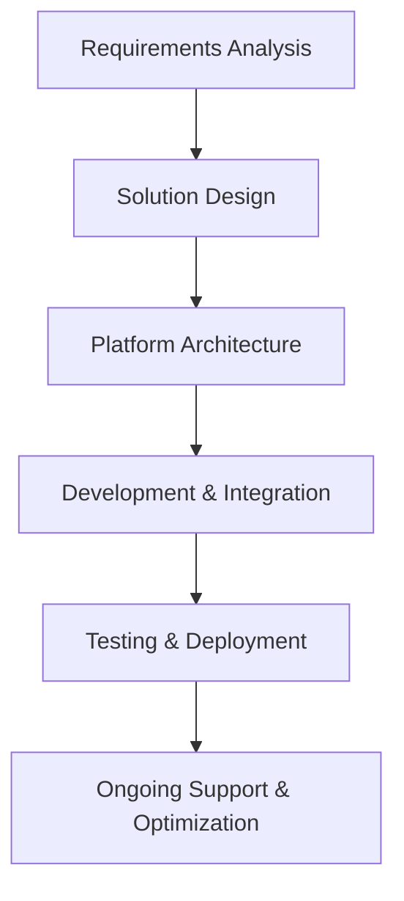
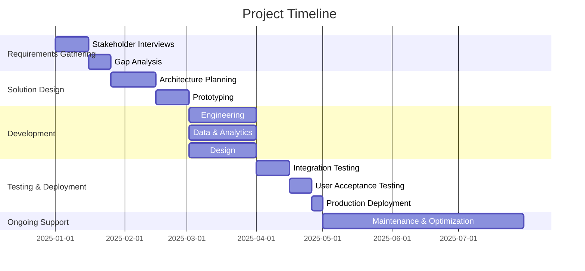

## Executive Summary

- Comprehensive solution to modernize financial services through engineering, data, and design capabilities
- Leverage Azure, AWS, Databricks, and Power BI to deliver innovative, secure, and scalable services
- Proven track record in government and commercial projects
- Dedicated team of experts to ensure successful delivery
- Competitive pricing aligned with Uniform Contract Format

---

## Requirements

| Requirement | Description |
| --- | --- |
| Engineering | Application development, infrastructure management, DevOps |
| Data | Data engineering, analytics, visualization |
| Design | User experience, interface design, product management |
| Technologies | Azure, AWS, Databricks, Power BI |
| Submission Due Date | 2025-02-28 |

---

## Proposed Solution

- Comprehensive solution leveraging cloud-native technologies
- Modular and scalable architecture to address evolving needs
- Seamless integration of engineering, data, and design capabilities
- Robust security and compliance measures

---

## Methodology

---

## Our Team

- Experienced project managers and technical leads
- Certified in Azure, AWS, Databricks, and Power BI
- Proven track record in delivering complex financial services solutions

---

<!-- _backgroundColor: #f0f0f0 -->

## Why Choose Us?

- Comprehensive solution addressing all your requirements
- Leveraging cutting-edge cloud technologies for scalability and security
- Dedicated team of experts with a strong track record
- Competitive pricing aligned with Uniform Contract Format
- Commitment to ongoing support and optimization

---

<!-- _class: invert -->

# Let's Transform Financial Services Together

Contact us today to discuss how we can help you achieve your goals.

[info@company.com](mailto:info@company.com)
[+1 (555) 555-5555](tel:+15555555555)