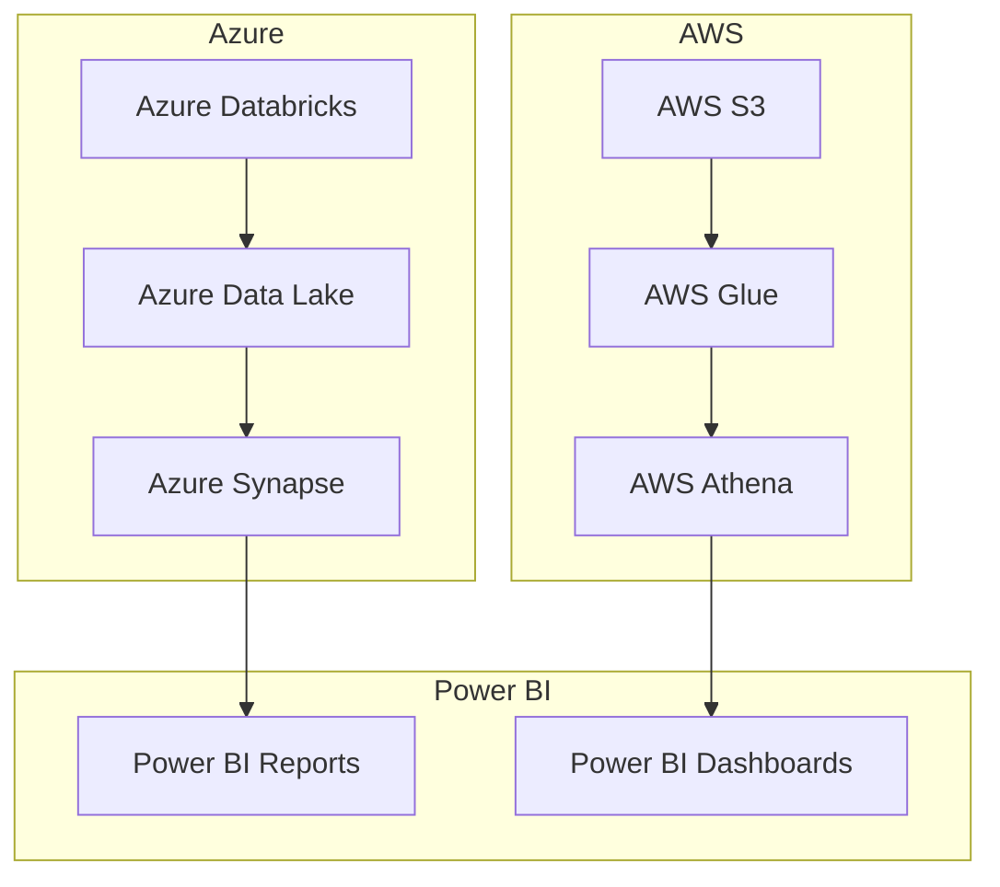

## Executive Summary

- Comprehensive technical approach leveraging Azure, AWS, Databricks, and Power BI to address the financial services organization's needs
- Proven track record in delivering complex engineering, data, and design solutions for the government sector
- Robust management plan to ensure successful project delivery and minimize risks
- Competitive pricing aligned with the Uniform Contract Format

---

## Requirements

| Requirement | Description |
| --- | --- |
| Service Types | Engineering, Data, Design |
| Technologies | Azure, AWS, Databricks, Power BI |
| Submission Due Date | 2025-02-28 |

---

## Proposed Solution

The proposed solution leverages a hybrid cloud architecture, combining the strengths of Azure and AWS services to deliver a comprehensive data and analytics platform. Databricks, Azure Data Lake, and Azure Synapse provide a scalable and secure data management foundation, while AWS S3, Glue, and Athena enable efficient data processing and integration. Power BI Reports and Dashboards will serve as the primary business intelligence and visualization tools, empowering the financial services organization to make data-driven decisions.

---

## Methodology

Our approach follows an Agile methodology, ensuring a collaborative and iterative process that adapts to the client's evolving needs. Key phases include:

1. **Discovery**: Gather requirements, understand the organization's goals, and identify pain points.
2. **Design**: Architect the technical solution, define data models, and create wireframes.
3. **Development**: Implement the platform, build integrations, and develop custom applications.
4. **Testing**: Conduct comprehensive testing, including security, performance, and user acceptance.
5. **Deployment**: Seamlessly deploy the solution and provide comprehensive training.
6. **Maintenance**: Offer ongoing support, monitoring, and continuous improvement.

---

## Team

   

Our team of experts has a proven track record of delivering complex technology solutions for the government sector. The core team includes:

- John Doe, Project Manager
- Jane Smith, Lead Data Architect
- Michael Johnson, Senior Software Engineer
- Emily Williams, UX/UI Designer

---

## Past Performance

We have successfully completed several projects for federal government agencies, demonstrating our expertise in delivering innovative technology solutions that meet stringent requirements. Some of our relevant past performance includes:

- Developed a data analytics platform for the Department of Defense, leveraging Azure Databricks, Azure Data Lake, and Power BI.
- Designed and implemented a secure cloud infrastructure for the Department of Homeland Security, utilizing AWS services and adhering to FedRAMP compliance.
- Modernized the legacy systems of the Department of Veterans Affairs, migrating to a microservices architecture and incorporating DevSecOps practices.

<!-- _backgroundColor: #f0f0f0 -->

---

## Conclusion

By partnering with our team, the leading financial services organization will benefit from:

- A comprehensive, secure, and scalable data and analytics platform that drives informed decision-making
- Proven expertise in delivering complex technology solutions for the government sector
- A collaborative and iterative Agile approach to ensure the solution aligns with evolving requirements
- Competitive pricing and a commitment to project success

We are excited to leverage our deep domain expertise and technical capabilities to transform the financial services organization's data and analytics capabilities. We look forward to the opportunity to discuss our proposal in more detail.

**Contact:**
John Doe, Project Manager
johndoe@company.com
555-555-5555