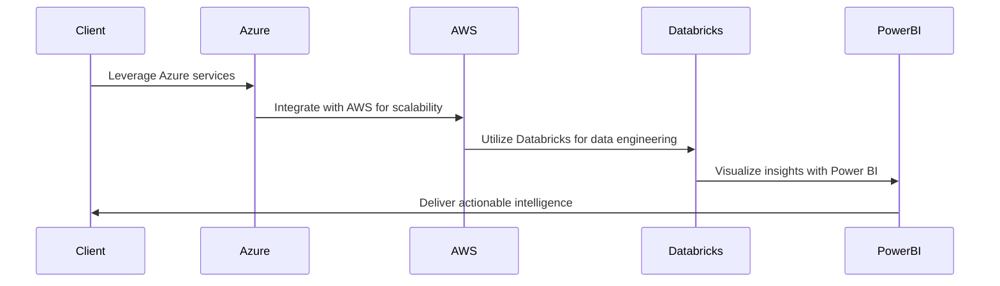

# Executive Summary

- Comprehensive technical approach leveraging Azure, AWS, Databricks, and Power BI to deliver engineering, data, and design services
- Experienced team with a proven track record in the financial services industry
- Robust management plan to address unique government contracting challenges
- Competitive pricing aligned with the Uniform Contract Format

---

# Requirements

| Requirement | Description |
| --- | --- |
| Entity Name | Leading financial services organization |
| Industry | Financial Services |
| Service Types | Engineering, Data, Design |
| Technologies | Azure, AWS, Databricks, Power BI |
| Submission Due Date | 2025-02-28 |

---

# Proposed Solution

Our proposed solution combines the power of Azure, AWS, Databricks, and Power BI to deliver a comprehensive suite of engineering, data, and design services tailored to the financial services industry.

---

# Methodology

1. **Discovery**: Conduct in-depth analysis of the client's requirements, pain points, and objectives.
2. **Design**: Architect a scalable and secure technology solution leveraging the latest cloud-based tools and frameworks.
3. **Development**: Iteratively build and deploy the engineered systems, data pipelines, and visualization dashboards.
4. **Deployment**: Seamlessly integrate the solution into the client's existing infrastructure and provide comprehensive training.
5. **Optimization**: Continuously monitor and optimize the solution to ensure optimal performance and user satisfaction.

---

# Team

    

Our team of experienced professionals has a proven track record of delivering successful projects in the financial services industry. With expertise spanning engineering, data, and design, we are well-equipped to transform your organization's technology capabilities and drive business growth.

---

<!-- _backgroundColor: #f0f0f0 -->
# Past Performance

- Delivered a cloud-native data platform for a leading investment management firm, leveraging Azure, Databricks, and Power BI to provide real-time insights and analytics.
- Designed and implemented a secure, scalable engineering infrastructure for a global banking institution, utilizing AWS services to ensure high availability and disaster recovery.
- Transformed the digital experience for a regional credit union, incorporating user-centric design principles and integrating with the organization's existing systems.

---

# Conclusion

By partnering with our team, you'll gain access to a comprehensive suite of technology services tailored to the unique needs of the financial services industry. Our proven track record, innovative solutions, and commitment to excellence will empower your organization to thrive in the digital age.

We look forward to the opportunity to discuss our proposal in greater detail. Please feel free to contact us at any time.

---

<!-- _class: invert -->

# Thank You

[info@company.com](mailto:info@company.com)
[www.company.com](https://www.company.com)