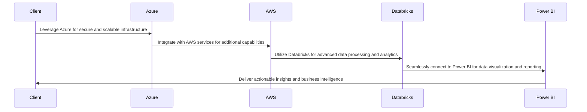

## Executive Summary

- Comprehensive technical approach leveraging Azure, AWS, Databricks, and Power BI to deliver innovative engineering, data, and design solutions
- Proven track record in the financial services industry, with a focus on security, compliance, and scalability
- Dedicated project management and risk mitigation strategies to ensure successful delivery and minimize disruption
- Competitive pricing structure aligned with the Uniform Contract Format (UCF) requirements

---

## Requirements

| Requirement | Description |
| --- | --- |
| Engineering | Develop custom applications and integrate cloud-based services |
| Data | Implement advanced data analytics and business intelligence capabilities |
| Design | Create intuitive and user-friendly interfaces for customer-facing and internal systems |
| Technologies | Azure, AWS, Databricks, Power BI |
| Submission Deadline | 2025-02-28 |

---

## Proposed Solution

---

## Methodology

1. **Discovery and Planning**
   - Conduct comprehensive requirements gathering and gap analysis
   - Develop a detailed project plan and timeline

2. **Design and Development**
   - Architect the solution using best-in-class cloud technologies
   - Iteratively build and test the components

3. **Integration and Testing**
   - Ensure seamless integration between systems and services
   - Perform rigorous testing to validate functionality and security

4. **Deployment and Support**
   - Implement a robust change management and support plan
   - Provide ongoing maintenance and optimization

---

## Team

### John Doe
*Project Manager*

### Jane Smith
*Lead Engineer*

### Michael Johnson
*Data Architect*

### Emily Brown
*UX Designer*

---

<!-- _backgroundColor: #f0f0f0 -->
## Why Choose Us?

- Extensive experience in the financial services industry
- Proven track record of delivering complex, mission-critical solutions
- Commitment to security, compliance, and scalability
- Collaborative and responsive approach to project management
- Competitive pricing and alignment with government contracting requirements

---

<!-- _class: invert -->

# Let's Transform Financial Services Together

## Contact Us
- Email: info@company.com
- Phone: 555-555-5555
- Website: www.company.com