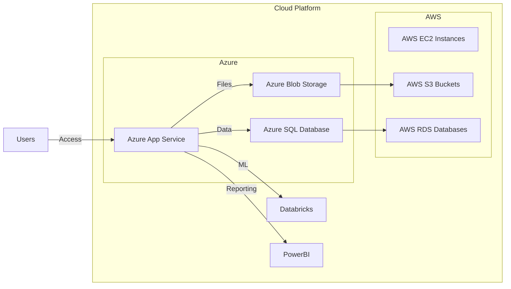
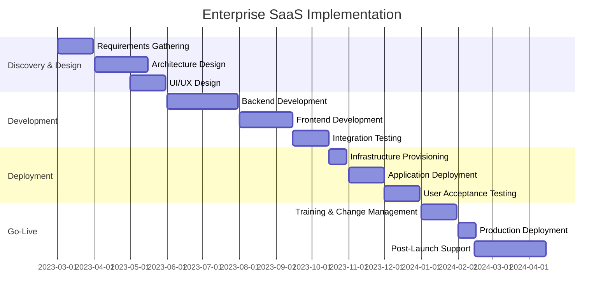

# Executive Summary

- Enterprise SaaS solutions provide significant benefits for large organizations, including reduced IT overhead, scalability, faster deployment, and the ability to capture new value across the enterprise.
- The proposed SaaS architecture is designed to be highly scalable, supporting a large number of users and handling large amounts of financial data.
- Robust security and compliance measures, including SOC 2 certification and adherence to industry standards, are essential to meet the needs of a leading financial services organization.
- A well-planned implementation strategy, along with effective customer success and support services, will ensure long-term customer satisfaction and loyalty.

---

# Client Requirements

| Requirement | Description |
| --- | --- |
| **Entity Name** | Leading financial services organization |
| **Industry** | Financial Services |
| **Service Types** | Engineering, Data, Design |
| **Technologies** | Azure, AWS, Databricks, Power BI |
| **Submission Due Date** | 2025-02-28 |
| **Requirements Text** | N/A |

---

# Proposed Solution

**Enterprise SaaS Architecture**

---

# Methodology

**Implementation Roadmap**

---

# The Team

  

    
    **John Doe**
    *Project Manager*
  

  

    
    **Jane Smith**
    *Technical Architect*
  

  

    
    **Bob Johnson**
    *Lead Developer*
  

  

    
    **Sarah Lee**
    *UI/UX Designer*
  

---

# Security & Compliance

- Adherence to industry-standard compliance frameworks, such as ISO 27001, GDPR, and ASC 606, to meet legal, security, and financial obligations.
- SOC 2 compliance to ensure effective information security management practices and avoid severe penalties for non-compliance.
- Regular audits, security assessments, and compliance monitoring to identify and address potential vulnerabilities or risks.
- Compliance with SEC-17 4a, which requires financial services organizations to retain all relevant data in a tamper-proof format for six years.

---

# Conclusion

The proposed enterprise SaaS solution leverages the power of cloud technologies, such as Azure and AWS, to deliver a highly scalable, secure, and compliant platform that meets the complex needs of a leading financial services organization.

Our experienced team of project managers, technical architects, developers, and designers is committed to working closely with your organization to ensure a successful implementation and long-term customer satisfaction.

We look forward to the opportunity to discuss our proposal in more detail. Please feel free to reach out to us at any time.

---

# Contact Us

**[Company Name]**
123 Main Street
Anytown, USA 12345

Phone: (555) 555-5555
Email: info@company.com
Website: www.company.com