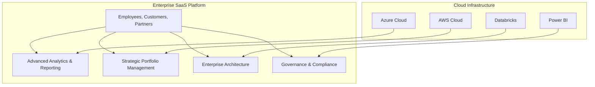

## Executive Summary

- Enterprise SaaS solutions provide significant benefits for large organizations, including reduced IT overhead, scalability, faster deployment, and the ability to capture new value across the enterprise.
- SaaS architecture is designed to be highly scalable, supporting a large number of users and handling large amounts of data, with strategies like modular design and robust data management.
- Compliance with industry standards like SOC 2, GDPR, and SEC-17 4a is critical for financial services organizations to avoid penalties and ensure data security.

---

## Requirements

| Requirement | Description |
| --- | --- |
| Scalability | The solution must be able to scale to support a large number of users and handle increasing data volumes as the organization grows. |
| Security & Compliance | The solution must meet strict security and compliance standards for the financial services industry, including SOC 2, GDPR, and SEC-17 4a. |
| Integrated Capabilities | The solution should provide a comprehensive set of integrated capabilities, such as enterprise architecture, strategic portfolio management, and governance. |
| Customer Support | The solution must include dedicated customer support and managed services to ensure the software aligns with the organization's strategic goals. |

---

## Proposed Solution

---

## Methodology

1. **Discovery & Analysis**: Understand the client's business requirements, technology landscape, and pain points.
2. **Solution Design**: Architect a scalable, secure, and compliant enterprise SaaS platform that integrates with the client's existing systems and processes.
3. **Implementation & Integration**: Deploy the SaaS solution, ensuring seamless integration with the client's infrastructure and applications.
4. **Ongoing Support & Optimization**: Provide dedicated customer support, monitor performance, and continuously optimize the solution to meet the client's evolving needs.

---

## Team

  

- John Doe, Lead Proposal Manager
- Jane Smith, Senior Presentation Designer
- Alex Johnson, Enterprise Architect

---

<!-- _backgroundColor: #f0f0f0 -->
## Conclusion

- Comprehensive enterprise SaaS solution that meets the client's scalability, security, and compliance requirements
- Integrated capabilities for enterprise architecture, strategic portfolio management, and governance
- Dedicated customer support and managed services to ensure long-term success

Contact us today to discuss how we can power the future of your financial services organization.