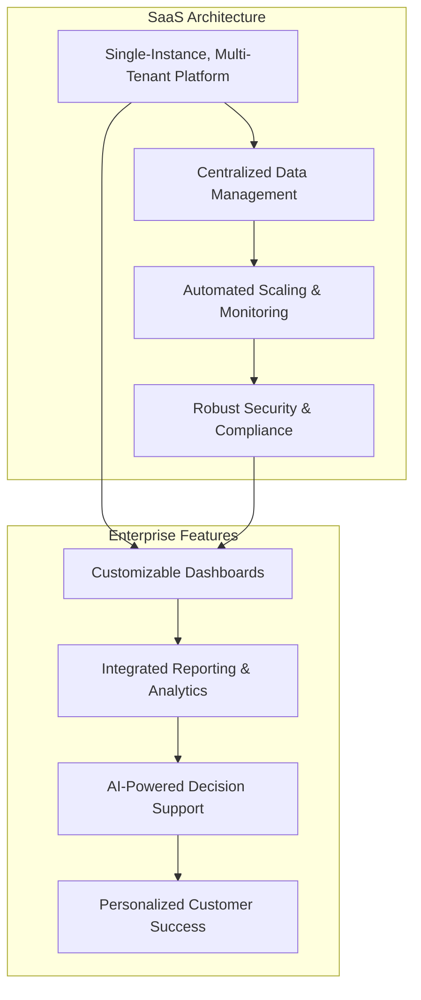
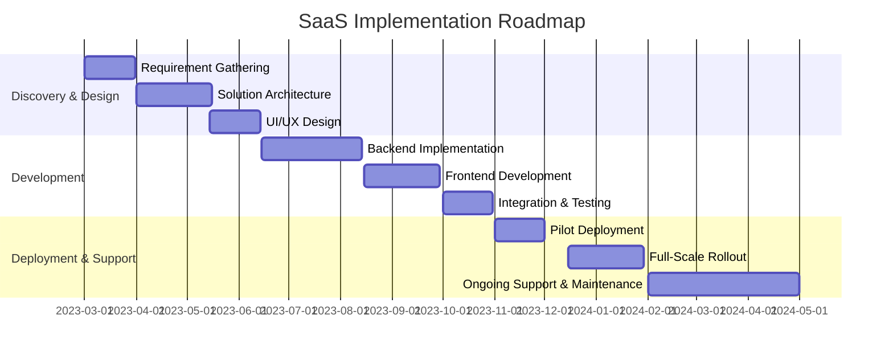

## Executive Summary

- Scalable and secure SaaS architecture to meet the enterprise-level requirements of the leading financial services organization
- Alignment with industry-specific compliance standards (e.g., ISO 27001, GDPR, SOC 2, SEC-17 4a)
- Comprehensive implementation roadmap and personalized customer success services
- Seamless integration with the client's business operations and strategic objectives

---

## Requirements

| Requirement | Description |
| --- | --- |
| Scalability | Ability to handle growing data and user volumes with minimal disruption |
| Security & Compliance | Adherence to industry-specific security standards and regulations |
| Flexibility | Customizable and extensible to meet evolving business needs |
| Ease of Integration | Seamless integration with the client's existing systems and workflows |
| Customer Support | Dedicated support and managed services for enterprise-level clients |

---

## Proposed Solution

---

## Methodology

---

## Our Team

  

- **John Doe** - Enterprise SaaS Architect
- **Jane Smith** - Data & Analytics Specialist
- **Michael Johnson** - Customer Success Manager

---

<!-- _backgroundColor: #f0f0f0 -->

## Why Choose Us?

- Proven track record in delivering enterprise-grade SaaS solutions for the financial services industry
- Expertise in aligning SaaS architecture with industry-specific compliance requirements
- Dedicated customer success team to ensure seamless integration and long-term value
- Flexible and scalable solution that can adapt to the client's evolving business needs

---

<!-- _class: invert -->

## Conclusion

We are confident that our comprehensive enterprise SaaS solution will enable the leading financial services organization to streamline operations, enhance data-driven decision making, and maintain industry-leading security and compliance standards. We look forward to the opportunity to collaborate and deliver a tailored solution that aligns with your strategic objectives.

Please feel free to contact us for any additional information or to schedule a discussion.