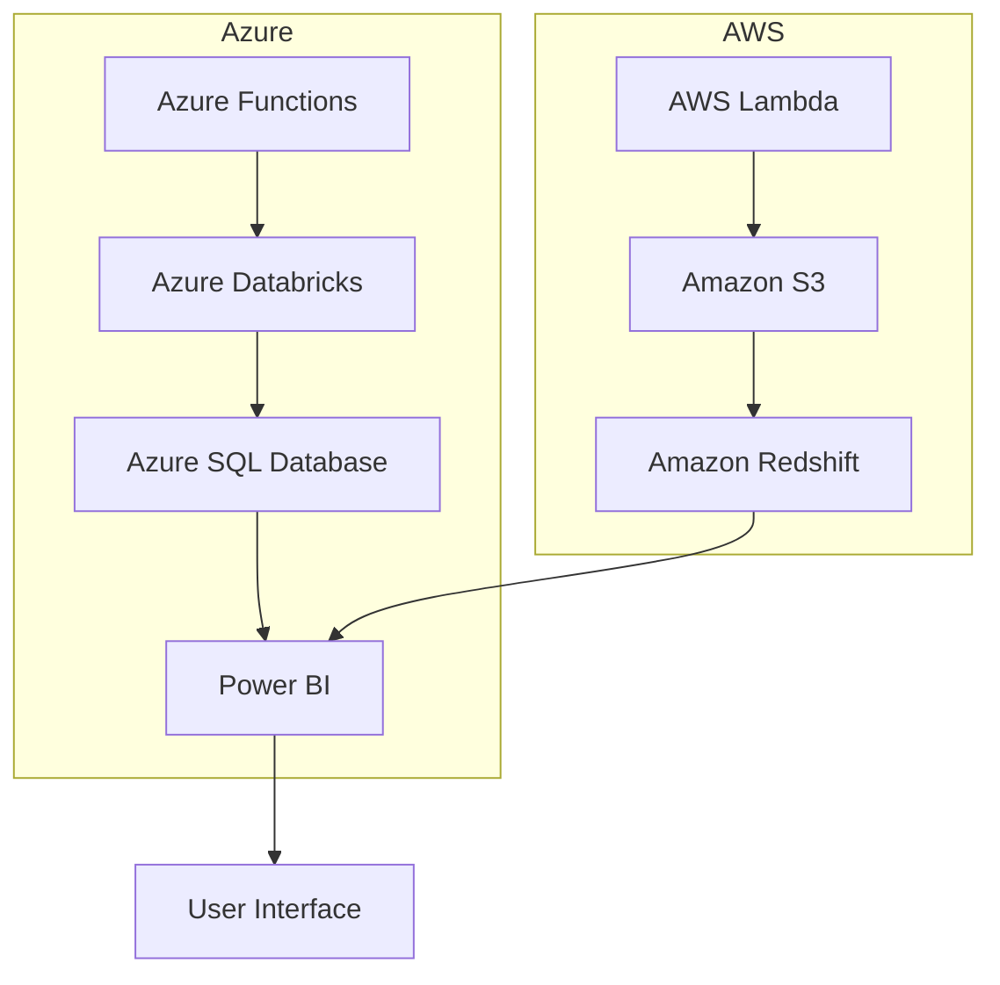

## Executive Summary

- Leveraging our expertise in Engineering, Data, and Design to deliver innovative solutions for the leading financial services organization
- Proposing a comprehensive suite of services powered by Azure, AWS, Databricks, and Power BI
- Highlighting our proven track record of successful projects in the financial services industry
- Committing to meet the submission deadline of February 28, 2025

---

## Requirements

| Requirement | Description |
| --- | --- |
| Engineering | Develop and maintain scalable, secure, and high-performing systems |
| Data | Collect, analyze, and derive insights from complex financial data |
| Design | Create intuitive and user-friendly digital experiences for financial services |
| Technologies | Azure, AWS, Databricks, Power BI |
| Submission Deadline | February 28, 2025 |

---

## Proposed Solution

Our proposed solution leverages a hybrid cloud architecture, utilizing the strengths of both Azure and AWS to deliver a comprehensive suite of services. Key components include:

- **Azure Functions:** Serverless compute for scalable and event-driven processing
- **Azure Databricks:** Unified analytics platform for big data and machine learning
- **Azure SQL Database:** Managed relational database for secure data storage
- **Power BI:** Business intelligence and data visualization tool for insights
- **AWS Lambda:** Serverless compute for event-driven processing
- **Amazon S3:** Scalable object storage for data lake
- **Amazon Redshift:** Petabyte-scale data warehouse for advanced analytics

---

## Methodology

1. **Discovery:** Conduct comprehensive assessment of the client's existing systems, data, and business requirements
2. **Design:** Architect the hybrid cloud solution, defining the technical specifications and integration points
3. **Development:** Implement the proposed solution, including the deployment of Azure and AWS services
4. **Testing:** Rigorously test the system for performance, security, and compliance
5. **Deployment:** Seamlessly migrate the client's systems and data to the new platform
6. **Support:** Provide ongoing maintenance, monitoring, and support to ensure the solution's long-term success

---

## Team

   

Our team of experts has extensive experience in delivering innovative solutions for the financial services industry. We have a proven track record of successfully implementing complex projects using the latest cloud technologies, data analytics, and user-centric design.

---

## Conclusion

<!-- _backgroundColor: #f0f0f0 -->

By partnering with our organization, the leading financial services organization can leverage our expertise in Engineering, Data, and Design to transform their operations and stay ahead of the competition. Our comprehensive solution, powered by Azure and AWS, will provide the scalability, security, and business intelligence needed to drive innovation and deliver exceptional customer experiences.

We are committed to meeting the submission deadline of February 28, 2025, and look forward to the opportunity to discuss our proposal in more detail.

**Contact:**
John Doe, Proposal Manager
john.doe@company.com
+1 (555) 555-5555